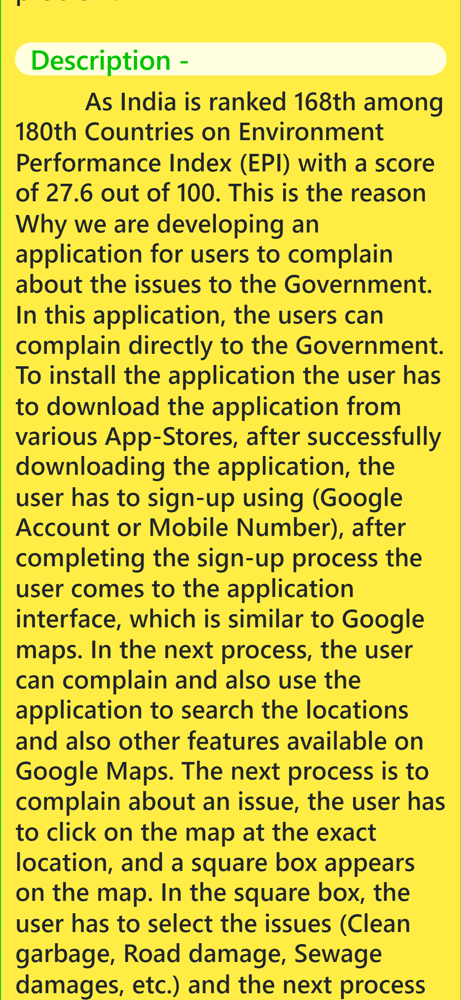
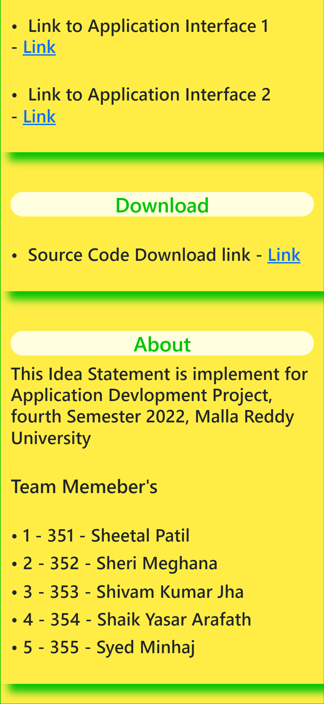
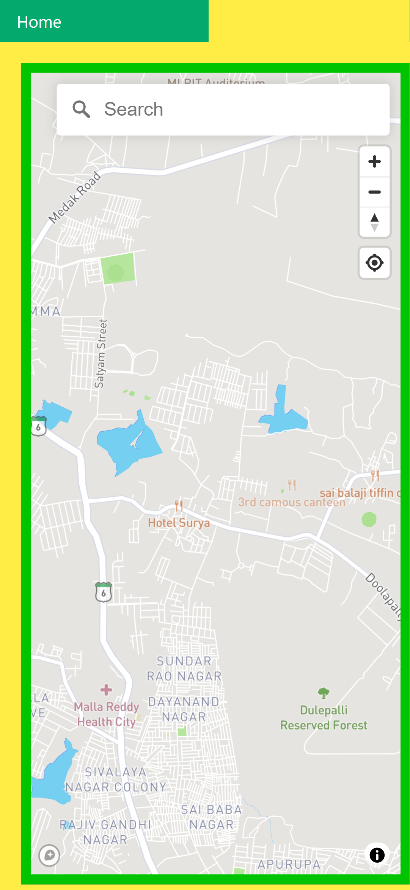
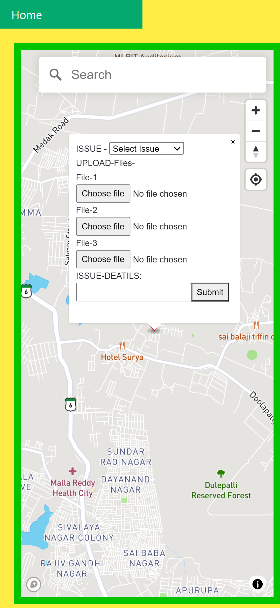
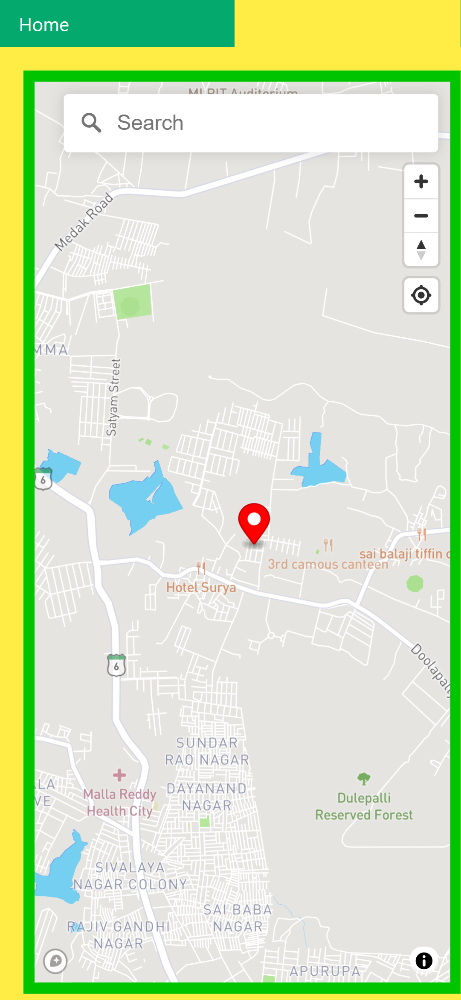
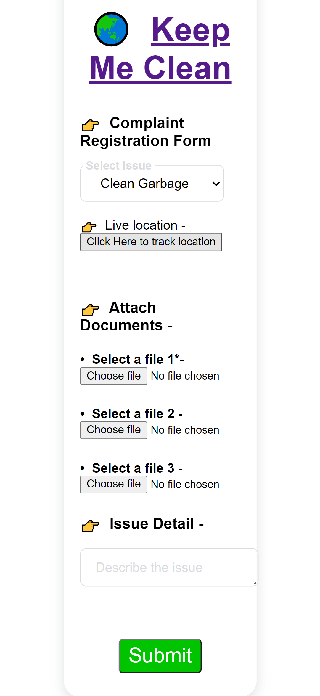

# AD-Project-
Academic project submission fourth semester  

<h1>&#127759; &nbsp;Abstract </h1>

In India, everyone knows the conditions of Garbage disposal, Road damage, Sewage damage, etc., these Problems are affecting our daily life and We don’t have a proper complaint system to solve the Issue as-fast-as-possible. So, Here comes our application to solve the problems related to a particular Issue. In our application users have to select the issue and the next step is to upload the images or videos and the final step is to submit the issue. These submitted Issues are updated on the map with the exact location of the user with a red dot and these red dots are visible to every user of the application. The next process is to solve the Issue, The Municipal worker’s team will identify the red dots visible on the map and solve the problem.

<h1> <b> Main WEBSITE Pictures </b> </h1>

The Website contents all the details about the project - <a href="https://kmcproject.blogspot.com">Website Link</a>

                   

<h1> <b>&bull; &nbsp; Application Interface - I Pictures </b> </h1>

Interface I Website - <a href="https://applicationinterfacekmc.blogspot.com">Website Link</a>

      

<h1> <b>&bull; &nbsp; Application Interface - II Pictures </b> </h1>

Interface II Website - <a href="https://kmcapplicationinterface2.blogspot.com">Website Link</a>

  
